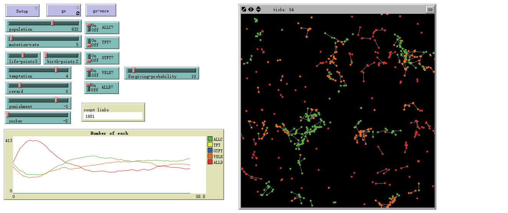

# 进化囚徒困境模型
*文件名：[EvoPD.nlogo](./EvoPD.nlogo)*
___
## 模型简介
本程序演示了带有遗传变异的重复囚徒困境模型，参考了这篇文章：[当重复囚徒困境遇到自然选择](http://www.douban.com/note/284753369/)

本程序共有4种回报方式，分别为T、R、P和S，其具体如下表所示：
|玩家1\\玩家2|合作	| 背叛	| 
|:-:|:-|:-|
|**合作**|回报值(reward)|受骗值(sucker)\\诱惑值(temptation)|
|**背叛**| 诱惑值(temptation)\\受骗值(sucker)|惩罚值(punishment)|
且$T>R>P>S$.

本程序共提供5种策略，分别为参考文章中所指的ALLC、ALLD、TFT、GTFT和WSLS，其具体如下表所示：
|名称| 意义	| 策略	| 
|:-:|:-:|:-:|
|ALLC|始终合作<br>(always cooperate)|始终选择合作	|
|ALLD| 始终背叛<br>(always defect)|始终选择背叛|
|TFT|以牙还牙<br>(tit-for-tat)|遇到新对手始终合作<br>遇到老对手重复对方上次的选择|
|GTFT| 慷慨地以牙还牙<br>(generous tit-for-tat)|与以牙还牙相同<br>但每次选择背叛有一定的几率选择合作|
|WSLS|输则改之，赢则加勉<br>(win-stay, lose-shift)|每次遭到背叛就改变策略<br>否则不保持当前选择|

___
## 界面分析
程序界面如下图所示：



最下方图表为各个策略人数变化曲线，世界图像中不同颜色的粒子代表不同策略（见图表中图例），用直线连接的两个粒子表示当前正在进行博弈，每局每个粒子仅能与一个粒子进行博弈，并将博弈结果加入生命值（博弈结果有正有负）。当生命值小于零时，粒子被淘汰、消失，由剩下的粒子进行生殖，其子代与母体策略相同，并根据变异率对部分新生粒子进行策略的改变。

界面各参数意义如下：
|参数|意义|
|---|---|
|```population```|总人数|
|```mutation-rate```|变异率|
|```life-points```|初始生命值|
|```temptation```|诱惑值|
|```reward```|回报值|
|```punishment```|惩罚值|
|```sucker```|受骗值|
|```ALLC?```|是否有始终合作者？|
|```TFT?```|是否有以牙还牙者？|
|```GTFT?```|是否有慷慨的以牙还牙者？|
|```forgiving-probability```|慷慨的以牙还牙者由背叛变为合作的概率|
|```WSLS?```|是否有输则改之、赢则加勉者？|
|```ALLD?```|是否有始终背叛者？|

___
## 代码分析
```
turtles-own [strategy score choice status]
links-own [last-choice1 last-choice2]
```
海龟变量：
|变量|意义 |
|:---|:---|
| ```strategy```| 策略|
|```  score```|分数（即生命值）|
| ``` choice```|当前选择：背叛或是合作|
| ```status```|博弈的结果：T或R或P或S|

连线变量：
|变量|意义 |
|:---|:---|
| ```last-choice1```|连线这一端的粒子上次与另一端粒子博弈时的选择|
|```  last-choice2```|连线另一端的粒子上次与这一端粒子博弈时的选择|

```
to setup
    clear-all
    set-default-shape turtles "circle"
    make-turtles
    reset-ticks
end
```
设定初始参数，并产生乌龟。

```
to make-turtles
    if (any? turtles) [
    ask n-of min (list round (num-to-make * (1 - (mutation-rate / 100))) (count turtles) ) turtles [give-birth] ]
    create-turtles num-to-make [……]
end

to-report num-to-make
    report (population - count turtles)
end
```
以上代码流程图如下所示：
```flow
st=>start: make-turltes
e=>end
cond=>condition: 当前是否有粒子? 
（初始没有粒子）
cur=>condition: 当前粒子数量 > 
所需不变异粒子数量?
allnot=>operation: 让所有粒子生成后代
mut=>operation: 随机生成（变异的）粒子
nmut=>operation: 随机选择所需的粒子生成后代
st->cond->cur->nmut->mut->e
cond(yes)->cur
cond(no)->mut
cur(yes)->nmut
cur(no)->allnot->mut
```
其中```create-turtles num-to-make [……]```中的内容为
```
……
let marker random num-of-strategies
        if (ALLC?) [
            if(marker = 0)
                [set strategy "ALLC"
                 set color green
                 set choice "cooperate"]
            set marker marker - 1]
        if (TFT?) [
            if(marker = 0)
                [set strategy "TFT"
                 set color yellow
                 set choice "cooperate"]
            set marker marker - 1]
        if (GTFT?) [
            if(marker = 0)
                [set strategy "GTFT"
                 set color blue
                 set choice "cooperate"]
            set marker marker - 1]
        if (WSLS?) [
            if(marker = 0)
                [set strategy "WSLS"
                 set color orange
                 set choice "cooperate"]
            set marker marker - 1]
        if (marker = 0)
                [set strategy "ALLD"
                 set color red
                 set choice "defect"]
    setxy random-xcor random-ycor
    set score (life-points)
    set status "R"
    ……

to-report num-of-strategies
    let num 0
    if(ALLC?) [set num num + 1]
    if( TFT?) [set num num + 1]
    if(GTFT?) [set num num + 1]
    if(WSLS?) [set num num + 1]
    if(ALLD?) [set num num + 1]
    if(num = 0) [set num 6]
    report num
end
```
这段代码首先生成一个marker用来随机选择已开启的策略，并对每个生成的粒子还进行了初始化，如策略、颜色、初始状态、初始选择等。有关marker的流程图如下
```flow
st=>start: Start
genmarker=>operation: 产生0到总策略数量的随机整数marker
allc=>condition: ALLC策略被开启？
tft=>condition: TFT策略被开启？
gtft=>condition: GTFT策略被开启？
wsls=>condition: WSLS策略被开启？
alld=>condition: ALLD策略被开启？
（必然，无需判断）
marker0=>condition: marker = 0?
marker1=>condition: marker = 0?
marker2=>condition: marker = 0?
marker3=>condition: marker = 0?
marker4=>condition: marker = 0?
（必然，无需判断）
submarker0=>operation: marker=marker-1
submarker1=>operation: marker=marker-1
submarker2=>operation: marker=marker-1
submarker3=>operation: marker=marker-1
submarker4=>operation: marker=marker-1
genallc=>operation: 产生一个ALLC者
gentft=>operation: 产生一个TFT者
gengtft=>operation: 产生一个GTFT者
genwsls=>operation: 产生一个WSLS者
genalld=>operation: 产生一个ALLD者
ed=>end
st->genmarker->allc
allc(yes)->marker0
allc(no)->tft
marker0(yes)->genallc->ed
marker0(no)->submarker0->tft
tft(yes)->marker1
tft(no)->gtft
marker1(yes)->gentft->ed
marker1(no)->submarker1->gtft
gtft(yes)->marker2
gtft(no)->wsls
marker2(yes)->gengtft->ed
marker2(no)->submarker2->wsls
wsls(yes)->marker3
wsls(no)->wsls
marker3(yes)->genwsls->ed
marker3(no)->submarker3->alld
alld(yes)->marker4
marker4(yes)->genalld->ed
```
```
to go
    ask links [hide-link] ;隐藏没有当前博弈的连线
    ask turtles [move] ;让粒子随机游走
    ask turtles [make-links] ;让粒子随机就近选择另一粒子进行博弈
    ask links with [hidden? = false] [game] ;让显示有连线的两个粒子博弈
    ask turtles with [score <= 0] [die] ;让生命值小于零的粒子淘汰
    make-turtles 产生新粒子
    tick
end
```
```
to move
    rt random-normal 0 20 ;以正态分布方式产生均值为0，方差为20的随机角度
      fd 0.5 ;向前走0.5格
end
```
```
to give-birth
    set score round (score / 2) ;将生命值减半（与子代均分）
    hatch 1 ;产生一个后代
end
```
```
to make-links
    if (my-shown-links != 0) [stop] ;如果已有博弈对象则跳出该环节
    ; 随机选择一个尚未配对的邻居
    let hidden-links-neighbor
        one-of (other turtles in-radius 5 with [my-shown-links = 0])
    ;如果存在这样的邻居，则判断之前是否有过博弈
    if (hidden-links-neighbor != nobody) [
        ifelse (is-link? link ([who] of self) ([who] of hidden-links-neighbor)) [
        ask link ([who] of self) ([who] of hidden-links-neighbor) [show-link] ;之前有过博弈，则让连线显示出来
        ] [
        create-link-with hidden-links-neighbor [
            set last-choice1 "cooperate"
            set last-choice2 "cooperate" ]
        ] ] ; 之前未有博弈，则建立连线，并设定历史选择为“合作”（因为以牙还牙者首次都是合作）

to-report my-shown-links
    report count (my-links with [hidden? = false]) ;返回以配对玩家数（配对为1，未配对为0）
end
```
```
to game
    make-choice ;根据自己的策略做选择
    judge ;根据双方选择判断双方的结果
    update-status ;更新生命值等状态
end
```
```
to make-choice
    ; 如果端点1是以牙还牙者（包括慷慨的），那么以端点2的前一次选择为当前选择
    if ([strategy] of end1 = "TFT" or [strategy] of end1 = "GTFT") [
        ask end1 [
            set choice [last-choice2] of myself
            if (strategy = "GTFT" and choice = "defect"
            and random 100 <= forgiving-probability) [
                set choice "cooperate" ]
        ] ]
    ; 如果端点2是以牙还牙者（包括慷慨的），那么以端点1的前一次选择为当前选择
    if ([strategy] of end2 = "TFT" or [strategy] of end2 = "GTFT") [
        ask end2 [
            set choice [last-choice1] of myself
            if (strategy = "GTFT" and choice = "defect"
            and random 100 <= forgiving-probability) [
                set choice "cooperate" ]
        ] ]
    ; 如果两个端点中有输改赢冕者，根据上次各自博弈的结果作出选择
    ask both-ends [
        if (strategy = "WSLS") [
            if (status = "S")
                [ set choice "defect"]
            if (status = "P")
                [ set choice "cooperate"]
        ] ]
end
```
```
to judge
    ifelse [choice] of end1 = "cooperate" [
        ifelse [choice] of end2 = "cooperate" [
            ask both-ends [set status "R"]
        ] [
            ask end1 [set status "S"]
            ask end2 [set status "T"] ]
        ] [
        ifelse [choice] of end2 = "cooperate" [
            ask end1 [set status "T"]
            ask end2 [set status "S"]
        ] [
            ask both-ends [set status "P"] ] ]
end
```
根据选择与回报的关系（前文表格所示），作出结果的判断。
```
to update-status
    set last-choice1 [choice] of end1
    set last-choice2 [choice] of end2
    ask both-ends [set score score + payoff]
end

to-report payoff
    if (status = "R") [report reward]
    if (status = "S") [report sucker]
    if (status = "T") [report temptation]
    if (status = "P") [report punishment]
end
```
将当前选择变为历史选择，并依据结果更新生命值。

___
##难点与创新点
该程序难点与创新点在于如何记录双方的历史博弈选择，通常来讲，是使用二维数组形式储存，但由于粒子数目过多，会导致效率降低，甚至程序卡死，因此选择Netlogo自带的连线属性，可以只维护未被淘汰的粒子之间的关系，这样一来十分方便

___
##仍然存在的问题
本程序模拟的是一个十分依赖初始条件的混沌系统，而按照开头所给出的参考文章，应当会呈现出ALLD - TFT - GTFT - ALLC - ALLD的循环，但并未观察到。
