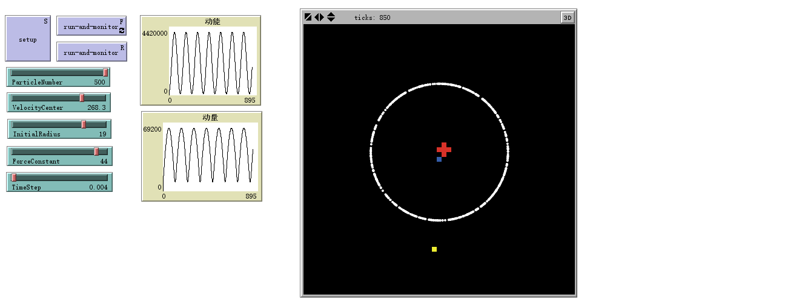

# 粒子运动模型 
*文件名：ParticlsMovement.nlogo*

## 模型简介
一群排列在圆周上的粒子，初速度指向圆周上某一点，且大小与到该点距离成正比，且始终受力心位于圆周，大小与距离成正比的吸引力，本程序模拟了这些粒子的运动。

## 界面分析
程序界面如下图所示：



## 代码分析
```NetLogo
globals [TotalLM TotalKE MassCenterX MassCenterY k Theta DeltaT D]
turtles-own [deltax deltay Vx dVx Vy dVy mass ke lm]
```

全局变量：

|变量|意义 |
|:---|:---|
| `TotalLM`| 总动量	|
| `TotalKE`| 总动能	|
| `MassCenterX`| 粒子质心横坐标	|
| `MassCenterY`| 粒子质心纵坐标|
| `Theta`| 初速度所指向的点在圆周上的幅角|
| `k`| 力的大小与距离所成的比例系数	|
| `DeltaT`| 差分步长	|
| `D`| 初始圆周半径	|

海龟变量：

|变量|意义 |
|:---|:---|
|`deltax`| 与某星球在x方向距离（同时也表示每次运动在x方向上的位移）|
|`deltay`| 与某星球在y方向距离（同时也表示每次运动在y方向上的位移）|
|`Vx`| x方向速度|
|`dVx`| x方向速度变化量	|
|`Vy`| y方向速度	|
|`dVy`| y方向速度变化量	|
|`mass`| 质量	|
|`ke`|动能|
|`lm `| 动量|
|`ep`| 势能|

```NetLogo
to setup
    clear-all
    set D InitialRadius
    set k ForceConstant
    set Theta VelocityCenter
    set DeltaT TimeStep
    crt ParticleNumber
    ask turtles [setup-turtles]
    set MassCenterX Sum ([mass * xcor] of turtles) / Sum [mass] of turtles
    set MassCenterY Sum ([mass * ycor] of turtles) / Sum [mass] of turtles
    ask patch (round MassCenterX) (round MassCenterY) [
       ask patches  in-radius 1 [
           set pcolor red
       ]
    ]
    ask patch 0 0 [
        set pcolor Blue
    ]
    ask patch (D * Cos Theta) (D * Sin Theta) [
        set pcolor Yellow
    ]
    reset-ticks
end
```

设定初始参数，如初始半径、作用力与距离比例系数、初速度所在点的幅角、差分时间步长、粒子数等等，并将质心标记为红色，初速度指向点位黄色（以下简称初速度心），力心（即圆心）标记为蓝色。

```NetLogo
to setup-turtles
  set color white
  set shape "circle"
  set size 0.5
  set mass 1
  foreach [who] of turtles
  [
    let angle random-float 360
    setxy D * Cos angle D * Sin angle
    set Vx D * Cos Theta - xcor
    set Vy D * Sin Theta - ycor
  ]
end
```

设置粒子的大小、颜色、形状，并随机产生角度分配位置。设定初速度与到初速度心的距离成正比，设比例系数为1.

```NetLogo
to run-and-monitor
  ask turtles [AP]
  ask turtles [move]
  ask patch (round MassCenterX) (round MassCenterY) [
     ask patches in-radius 1 [
         set pcolor black
     ]
  ]
  set MassCenterX Sum ([mass * xcor] of turtles) / Sum [mass] of turtles
  set MassCenterY Sum ([mass * ycor] of turtles) / Sum [mass] of turtles
  ask patch (round MassCenterX) (round MassCenterY) [
     ask patches in-radius 1 [
         set pcolor red
     ]
  ]
  ask patch 0 0 [
    set pcolor Blue
  ]
  ask patch (D * Cos Theta) (D * Sin Theta) [
    set pcolor Yellow
  ]
  set TotalLM sum [lm] of turtles
  set TotalKE sum [ke] of turtles
  tick
end
```

进行差分计算`AP`，并根据计算结果运动`move`，并实时更新质心位置，在更新质心位置之前还要查去之前标记的质心（变为黑色），为防止之前标记的质心与力心或初速度心重合而被擦除，因此每次都再一次标记力心与初速度心。

```NetLogo
to AP ; Artificial Physics
    set dVx 0 - (DeltaT * k * xcor / mass)
    set dVy 0 - (DeltaT * k * ycor / mass)
    set Vx (Vx + dVx)
    set Vy (Vy + dVy)
    set deltax (DeltaT * Vx)
    set deltay (DeltaT * Vy)
end
```

因本模型较简单，不用想万有引力模型中一样计算受力，可以直接根据受力分析、牛顿第二定律，写出其速度的变化量、速度及位移。

```NetLogo
to move
    set xcor (xcor + deltax)
    set ycor (ycor + deltay)
    set ke ((Vx * Vx + Vy * Vy) * mass / 2)
    set lm (mass * sqrt(Vx * Vx + Vy * Vy))
end
```

根据`AP`中计算出的实际移动位移`deltax`、`deltay`进行移动，并计算每个粒子的动能和动量。
