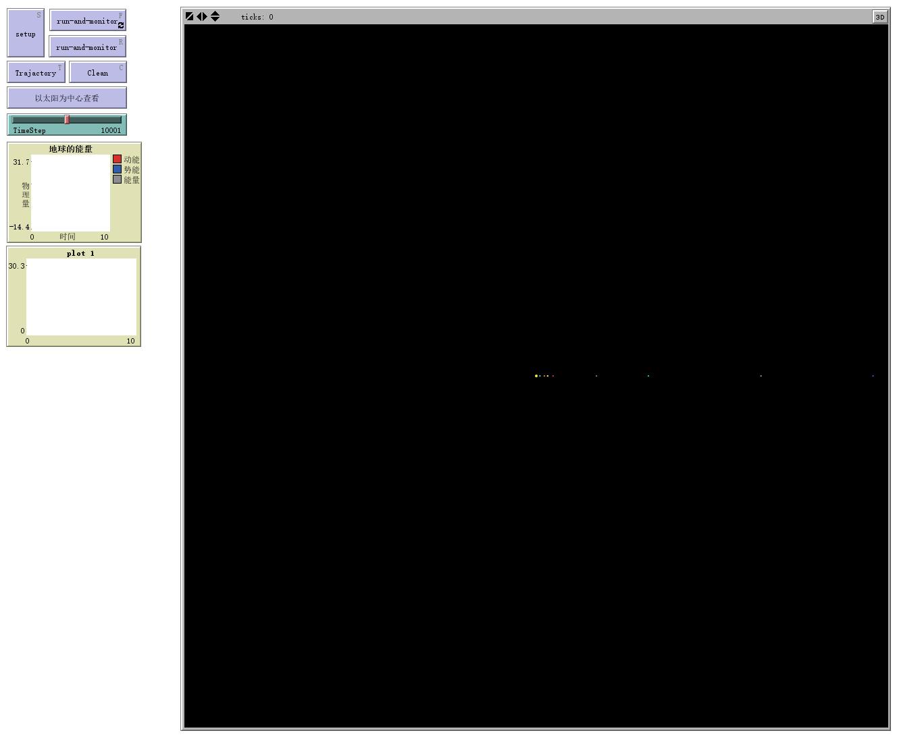
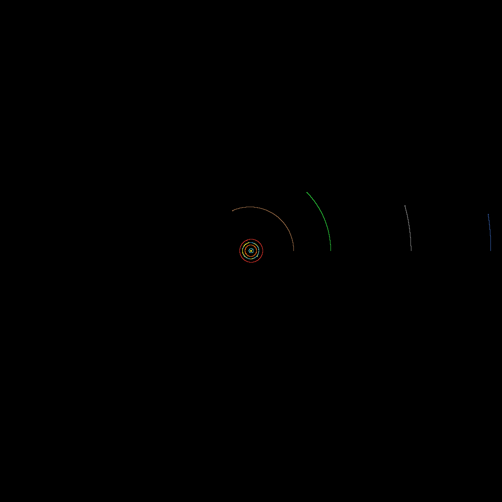
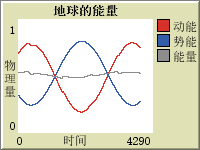
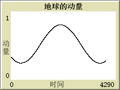

# 太阳系模型 
*文件名：[SolarSystem.nlogo](./SolarSystem.nlogo)*

## 模型简介
该模型主要应用欧拉向前差分法模拟了**太阳系八大行星绕太阳公转、月球绕地球公转**的运动。

每个星球都分析了其他所有星球对其的引力作用。

为方便观看，对星球的各个物理量单位进行了调整，并且为保证演示数据的可靠性，所有距离及速度均为平均值，具体数据如下：

| 序号	| 星球	| 质量<br>（单位：地球质量）	| 与太阳初始距离<br>（单位：光分）	| 公转速度<br>（单位：光分/秒）	|
|:-:|:-:|:-:|:-:|:-:|
| 0	| 太阳	| $3332948.6$	| $0	$| $0$	|
| 1	| 水星	| $0.0552734$	| $2.672$	| $2.64\times10^{-6}$	|
| 2	| 金星	| $0.814996$	| $5.976$	| $1.95\times10^{-6}$	|
| 3	| 地球	| $1$	| $8.369$	| $1.66\times10^{-6}$	|
| 4	| 火星	| $0.107447$	| $12.39$	| $1.33\times10^{-6}$	|
| 5	| 木星	| $317.828$	| $44.54$	| $7.23\times10^{-7}$	|
| 6	| 土星	| $95.1608$	| $1.383 \times 60$<br>（1光时 = 60光分）	| $5.36\times10^{-7}$	|
| 7	| 天王星	| $14.5357$	| $2.772 \times 60$	| $3.78\times10^{-7}$	|
| 8	| 海王星	| $17.1478$	| $4.154 \times 60$	| $3.02\times10^{-7}$	|
| 9	| 月亮	| $0.012$	| $8.399$	| $1.66\times10^{-6} - 5.67\times10^{-8}$ <br> (地球公转速度 + 月球绕地速度，反向相减)	|
|万有引力常量G|$6.85\times10^{-17}$|（单位：光分$^3$/(地球质量$\cdot$秒$^2$)）|

## 界面分析
程序界面如下图所示：


运行并显示轨迹，界面如下图所示：


点击“以太阳系为中心”弹出界面如下图所示，拖动`Watch-me`旁的滑块可以放大和缩小：


地球物理量（包括动能、势能、总能量、动量）的绘制如下图所示：





## 代码分析
```NetLogo
globals [TotalLM TotalKE TotalPE TotalEnergy G DeltaT]
turtles-own [hood deltax deltay r Fx Fy Vx dVx Vy dVy mass ke lm ep]
```

全局变量：

|变量|意义 |
|:---|:---|
| `TotalLM`| 总动量	|
| ` TotalKE`| 总动能	|
| `TotalPE`| 总势能	|
| `TotalEnergy`| 总能量	|
| `G`| 万有引力常数	|
| `DeltaT`| 差分步长	|

海龟变量：

|变量|意义 |
|:---|:---|
| `hood`| 其他星球列表|
| `deltax`| 与某星球在x方向距离（同时也表示每次运动在x方向上的位移）|
| `deltay`| 与某星球在y方向距离（同时也表示每次运动在y方向上的位移）|
| `r`|与某星球距离|
| `Fx`| x方向受力	|
| `Fy`| y方向受力|
| `Vx`| x方向速度|
| `dVx`| x方向速度变化量	|
| `Vy`| y方向速度	|
| `dVy`| y方向速度变化量	|
| `mass`| 质量	|
| `ke`|动能|
| `lm`| 动量|
| `ep`| 势能|

```NetLogo
to setup
    clear-all
    set G 6.85E-17 ;(("LightMinutes")^3)/("EarthMass""second"^2)
    set DeltaT TimeStep
    crt 10
    ask turtles [setup-turtles]
    reset-ticks
end
```

设定初始参数，如万有引力常量、差分时间步长等等，产生10个星球。

```NetLogo
to setup-turtles
    set shape "circle"
    set Vx 0
    if(who = 0) [
        set size 2 
        set mass 332948.6
        setxy 0 0
        set Vy 0
        set color Yellow
    ]
    if(who = 1) [
        set size 1 
        set mass 0.0552734
        setxy 2.672 0 
        set Vy 2.64E-6
        set color Cyan
    ]
    if(who = 2) [
        set size 1 
        set mass 0.814996
        setxy 5.976 0
        set Vy 1.95E-6
        set color orange
    ]
    if(who = 3) [
        set size 1 
        set mass 1
        setxy 8.369 0
        set Vy 1.66E-6
        set color Sky
    ]
    if(who = 4) [
        set size 1 
        set mass 0.107447
        setxy 12.39 0 
        set Vy 1.33E-6
        set color red
    ]
    if(who = 5) [
        set size 1 
        set mass 317.828
        setxy 44.54 0
        set Vy 7.23E-7
        set color brown
    ]
    if(who = 6) [
        set size 1 
        set mass 95.1608
        setxy 1.383 * 60 0
        set Vy 5.36E-7
        set color lime
    ]
    if(who = 7) [
        set size 1 
        set mass 14.5357
        setxy 2.772 * 60 0 
        set Vy 3.78E-7
        set color grey
    ]
    if(who = 8)	[
        set size 1 
        set mass 17.1478
        setxy 4.154 * 60 0
        set Vy 3.02E-7
        set color blue
    ]
    if(who = 9) [
        set size 1
        set mass 0.012
        setxy 8.399 0
        set Vy 1.66E-6 - 5.67E-8 
        set color Yellow
    ]
end
```

依据之前的表格，为每个星球设定相应的参数及不同的颜色。

```NetLogo
to run-and-monitor
    ask turtles [AP]
    ask turtles [move]
    set TotalLM sum [lm] of turtles
    set TotalKE sum [ke] of turtles
    set TotalPE sum [ep] of turtles
    set TotalEnergy (TotalKE + TotalPE)
    tick
end
```

让星球进行差分计算```AP```，并根据计算结果运动```move```，并对所有星球的物理量进行求和。

```NetLogo
to AP
    set hood [who] of other turtles
    set Fx 0
    set Fy 0
    set Ep 0
    foreach hood [
        set deltax (([xcor] of turtle ?) - xcor)
        set deltay (([ycor] of turtle ?) - ycor)
        set r sqrt(deltax * deltax + deltay * deltay)
        set Fx Fx + (G * [mass] of turtle ? * mass / ( r * r ) * deltax / r)
        set Fy Fy + (G * [mass] of turtle ? * mass / ( r * r ) * deltay / r)
        set Ep Ep - (G * [mass] of turtle ? * mass / r )
    ]
    set dVx (DeltaT * (Fx / mass) )
    set dVy (DeltaT * (Fy / mass) )
    set Vx (Vx + dVx)
    set Vy (Vy + dVy)
    set deltax (DeltaT * Vx)
    set deltay (DeltaT * Vy)
end
```

将其他星体赋值给列表```hood```，并将所有参量清零。
对```hood```列表中的每一个成员，计算与本星球距离的横纵坐标分量，并依据勾股定理求出距离。根据万有引力公式$$F=G\frac{m_1m_2}{r^2},$$求得本星球受力以及势能，再跟据牛顿第二定律$$F=ma,$$求出速度变化量、速度、及相应位移。

```NetLogo
to move
    set xcor (xcor + deltax)
    set ycor (ycor + deltay)
    set ke ((Vx * Vx + Vy * Vy) * mass / 2)
    set lm (mass * sqrt(Vx * Vx + Vy * Vy))
end
```
根据`AP`中计算出的移动位移`deltax`、`deltay`进行移动，并计算每个星球的动能和动量。

##难点
该程序难点在于对于受力方向的判断，因为各个星球受到的力始终是引力，那么受力的方向就与施力物体相对受力物体的坐标相同即：$$\vec{F_{引}} \parallel \left(\vec{r_{施力}}-\vec{r_{受力}}\right)$$
因此在`AP`中只需要弄清楚这一点即可。

##创新点
为了解决太阳系过大，而看不清的困难，我引入了“以太阳为中心查看”的按钮，按钮代码为`inspect turtle 0`，在弹出的窗口中滑动`Watch-me`旁的滑块即可放大缩小。

同时本模型加入了月球，但是十分微小，要以地球为中心观察时才能看到即使用`inspect turtles 3`命令，并且月球（黄色）与地球（蓝色）由于`set size  1`，体积均为1光分，重叠在了一起，但可以看出月球在绕地球旋转。

