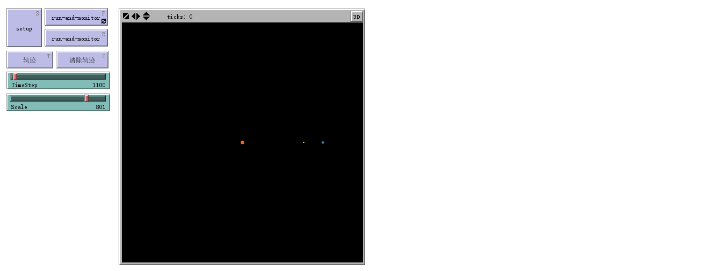
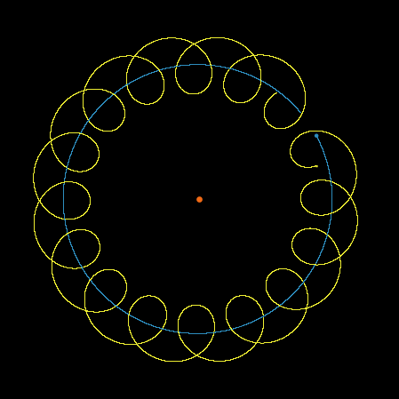

# 日地月三体模型 
*文件名：SunEarthMoon.nlogo*
___
## 模型简介
该模型主要应用欧拉向前差分法模拟了**地球绕太阳公转、月球绕地球公转**的三体运动。

每个星球都分析了其他所有星球对其的引力作用。

为方便观看，对星球的各个物理量单位进行了调整，并且为保证演示数据的可靠性，所有距离及速度均为平均值，具体数据如下：

| 序号	| 星球	| 质量<br>（单位：地球质量）	| 与太阳初始距离<br>（单位：光分）	| 公转速度<br>（单位：光分/秒）	|
|:-:|:-:|:-:|:-:|:-:|
| 0	| 太阳	| $3332948.6$	| $0	$| $0$	|
| 1	| 地球	| $1$	| $8.369$	| $1.66\times10^{-6}$	|
| 2	| 月亮	| $0.012$	| $8.369-0.02$<br>（日地距离+地月距离，反向相减）	| $1.66\times10^{-6} - 5.67\times10^{-8}$ <br> (地球公转速度 + 月球绕地速度，反向相减)	|
|万有引力常量G|$6.85\times10^{-17}$|（单位：光分$^3$/(地球质量$\cdot$秒$^2$)）|

本程序虽然大体上与太阳系模型接近，但是难点在于如何改变日地距离与地月距离的长度比，详见难点小节。
___
## 界面分析
程序界面如下图所示：


运行并显示轨迹，界面如下图所示：


___
## 代码分析
```
globals [TotalLM TotalKE TotalPE TotalEnergy G DeltaT]
turtles-own [hood deltax deltay r Rx Ry Fx Fy Vx dVx Vy dVy mass ke ep lm]
```

全局变量：
|变量|意义 |
|:---|:---|
| ```TotalLM```| 总动量	|
|``` TotalKE```| 总动能	|
| ```TotalPE```| 总势能	|
| ```TotalEnergy```| 总能量	|
| ```G```| 万有引力常数	|
| ```DeltaT```| 差分步长	|

海龟变量：
|变量|意义 |
|:---|:---|
| ```hood```| 其他星球列表|
|```  deltax```| 与某星球在x方向距离（同时也表示每次运动在x方向上的位移）|
| ``` deltay```| 与某星球在y方向距离（同时也表示每次运动在y方向上的位移）|
| ``` r```|与某星球距离|
|```Rx```|在x方向上实际距离|
|```Ry```|在y方向上实际距离|
| ```Fx```| x方向受力	|
| ```Fy```| y方向受力|
| ``` Vx```| x方向速度|
|``` dVx```| x方向速度变化量	|
| ``` Vy```| y方向速度	|
| ``` dVy```| y方向速度变化量	|
| ``` mass```| 质量	|
| ``` ke```|动能|
| ``` lm ```| 动量|
| ```ep```| 势能|

```
to setup
    clear-all
    set G 6.85E-17 ;(("LightMinutes")^3)/("EarthMass""second"^2)
    set DeltaT TimeStep
    crt 3 
    [
      set shape "circle"
    ]
    ask turtle 0 [setup-sun]
    ask turtle 1 [setup-earth]
    ask turtle 2 [setup-moon]
    reset-ticks
end
```
设定初始参数，如万有引力常量、差分时间步长等等，产生10个星球。

```
to setup-sun
    set size 3 
    set mass 332948.6
    set Rx 0
    set Ry 0
    setxy 0 0
    set Vx 0
    set Vy 0
    set color Orange
end

to setup-earth
    set size 2 
    set mass 1
    set Rx 8.369
    set Ry 0
    setxy Rx * scale / 100 Ry * scale / 100
    set Vx 0
    set Vy 1.66E-6
    set color Sky
end

to setup-moon
    set size 1
    set mass 0.012
    set Rx 8.369 - 0.02
    set Ry 0
    set xcor ((Rx - [Rx] of turtle 1) * Scale + [xcor] of turtle 1)
    set ycor ((Ry - [Ry] of turtle 1) * Scale + [ycor] of turtle 1)
    set Vx 0
    set Vy (1.66E-6 - 5.67E-8)
    set color Yellow
end
```
依据之前的表格，为每个星球设定相应的参数及不同的颜色，并根据实际距离将图像上地月间的距离，以地球为中心放大```Scale```倍，日地间距离以太阳为中心放大```Scale / 100```倍。

```
to run-and-monitor
    ask turtles [AP]
    ask turtles [move]
    set TotalLM sum [lm] of turtles
    set TotalKE sum [ke] of turtles
    set TotalPE sum [ep] of turtles
    set TotalEnergy (TotalKE + TotalPE)
    tick
end
```
让星球进行差分计算```AP```，并根据计算结果运动```move```，并对所有星球的物理量进行求和。

```
to AP ; Artificial Physics
    set hood [who] of other turtles
    set Fx 0
    set Fy 0
    set ep 0
    foreach hood [
        set deltax (([Rx] of turtle ?) - Rx)
        set deltay (([Ry] of turtle ?) - Ry)
        set r sqrt(deltax * deltax + deltay * deltay)
        set ep ep - (G * [mass] of turtle ? * mass / r )
        set Fx Fx + (G * [mass] of turtle ? * mass / ( r * r ) * deltax / r)
        set Fy Fy + (G * [mass] of turtle ? * mass / ( r * r ) * deltay / r)
    ]
    set dVx (DeltaT * (Fx / mass) )
    set dVy (DeltaT * (Fy / mass) )
    set Vx (Vx + dVx)
    set Vy (Vy + dVy)
    set deltax (DeltaT * Vx)
    set deltay (DeltaT * Vy)
end
```
将其他星体赋值给列表```hood```，并将所有参量清零。
对```hood```列表中的每一个成员，计算与本星球实际距离的横纵坐标分量，并依据勾股定理求出距离。根据万有引力公式$$F=G\frac{m_1m_2}{r^2},$$求得本星球受力以及势能，再跟据牛顿第二定律$$F=ma,$$求出速度变化量、速度、及相应位移。

```
to move
    set Rx (Rx + deltax)
    set Ry (Ry + deltay)
    ifelse(who = 2) [
        setxy (Rx - [Rx] of turtle 1) * Scale + [xcor] of turtle 1 (Ry - [Ry] of turtle 1) * Scale + [ycor] of turtle 1
    ] [
        setxy Rx * Scale / 100 Ry * Scale / 100
    ]
    set ke ((Vx * Vx + Vy * Vy) * mass / 2)
    set lm (mass * sqrt(Vx * Vx + Vy * Vy))
end
```
根据```AP```中计算出的实际移动位移```deltax```、```deltay```进行移动，并根据```Scale```对星球在界面上的展示位移进行转换，最后计算每个星球的动能和动量。

___
##难点
该程序的主要思路大致与太阳系模型相同，但难点在于地月距离远小于日地距离，因此如果不加一些人为的修改，无法合理地进行观察，因此本程序引入了比例变量```Scale```，使地月距离放大，同时为使月球在图像上不会过于靠近太阳，日地距离也放大```Scale``` 的百分之一。因此在程序编写时，要时刻注意实际距离与图像距离之间的转换，同时由于地月距离是以地球为中心放大的、日地距离是以太阳为中心放大的，因此每次进行转换都要分别讨论。

___
##仍然存在的问题
在运行程序并绘制轨迹时，发现在地球绕太阳一周（即一年的时间）内，月球绕地球16周，与现实中一年12个月不相符，原因尚不明确。
