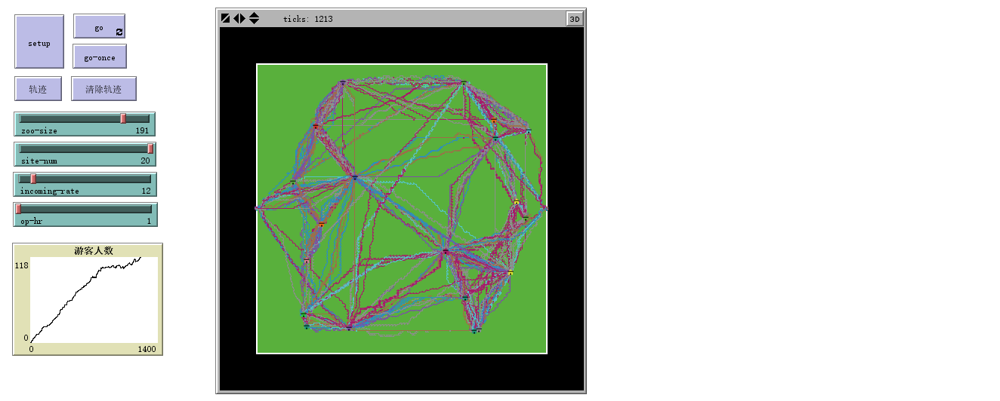

# 动物园行人模型
*文件名：ZooModel.nlogo*

## 模型简介
本程序依据[*Pedestrian Modelling in NetLogo*](https://scholar.googleusercontent.com/scholar.bib?q=info:D642eT9PKoMJ:scholar.google.com/&output=citation&scisig=AAGBfm0AAAAAWEWL08qWAwZRs6YQDV4YexcPVp-GH-Na&scisf=4&ct=citation&cd=-1&hl=en&scfhb=1)这篇论文，演示了动物园中游客依据自己所偏好的地点进行游览的路线，
本程序由一下几个部分组成：

```flow
st=>start: Start
ed=>end
op1=>operation: 生成动物园
op2=>operation: 产生游客
op3=>operation: 游客选择下一个目标
op4=>operation: 游客向目标靠近
op5=>operation: 游客到达目标
cond=>condition: 是否离开？
op6=>operation: 向出口靠近
op7=>operation: 到达出口
st->op1->op2->op3->op4->op5->cond->op6->op7->ed
cond(yes)->op6
cond(no)->op3
```

___
## 界面分析
程序界面如下图所示：


最下方图表为游客人数变化曲线，世界图像中的粒子代表游客。
绿色代表动物园内、房子代表景点、白色代表围墙、黑色代表动物园外。
界面各参数意义如下：
|参数|意义|
|---|---|
|`zoo-size`|动物园边长|
|`site-num`|景点数量|
|`incoming-rate`|每次产生游客的概率|
|`op-hr`|开放时间（小时）|


___
## 代码分析
```NetLogo
globals [op-sec total-attractiveness]
```
全局变量：

|变量|意义 |
|:---|:---|
| `op-sec`| 开放时间（秒）|
|`total-attractiveness`|景点总吸引力|

```NetLogo
breed [visitors visitor]
breed [sites site]
breed [walls site]
breed [gates gate]
```
生成不同物种（游客、经典、围墙、门口）

```NetLogo
turtles-own [
    force-factor
]

sites-own [
    attractiveness
    capacity
    num
]

visitors-own [
    destx
    desty
    status
    want-to
    been-to
    time-limit
    enjoy-limit
    speed
    nearestx
    nearesty
    nearest-preferx
    nearest-prefery
]
```

海龟变量：

|变量|意义 |
|:---|:---|
| `force-factor`| 排斥力系数|

景点变量：

|变量|意义 |
|:---|:---|
| `attractiveness`| 吸引力|
| `capacity`|承载力|
| `num`| 编号|

游客变量：
|变量|意义 |
|:---|:---|
| `destx`|目的地横坐标|
| `desty`|目的地纵坐标|
| `status`|当前状态（走动、观赏、离开）|
| `want-to`|想要游览的景点列表|
| `been-to`|已经游览的景点列表|
|`time-limit`|应离开的时间|
|`enjoy-limit`|当前观赏剩余时间|
|`speed`|行走速率|
|`nearestx`|未去过且距离最近的而非想要游览的景点的横坐标|
|`nearesty`|未去过且距离最近的而非想要游览的景点的横坐标|
|`nearest-preferx`|未去过且距离最近的想要游览的景点的横坐标|
|`nearest-prefery`|未去过且距离最近的想要游览的景点的纵坐标|

```NetLogo
to setup
  clear-all
  set-default-shape walls "tile brick"
  set-default-shape sites "house"
  set-default-shape gates "i beam"
  set op-sec op-hr * 3600
  draw-zoo
  reset-ticks
end
```

设置不同物种的形状、设置开放时间

```NetLogo
to draw-zoo
    ;; 生成动物园（绿色）
    ask patches with [
        abs pxcor < round (zoo-size / 2)
        and abs pycor < round (zoo-size / 2)
    ] [
        set pcolor green
    ]
    ;; 生成大门（蓝色）
    ask patches with [
        abs pxcor = round (zoo-size / 2) and abs pycor < 2
    ] [
        set pcolor blue
        sprout-gates 1 [
            set force-factor 0
        ]
    ]
    ;; 生成围墙（白色）
    ask patches with [
        pcolor = black
        and any? neighbors with [pcolor = green]
    ] [
        set pcolor white
        sprout-walls 1 [
            set color white
            set force-factor 2
        ]
    ]
    ;; 生成景点（屋子）
    set total-attractiveness 0
    ask n-of site-num patches with [
        pcolor = green
        and count neighbors with [pcolor != green] = 0
        and abs pxcor > 0.15 * zoo-size
        and abs pxcor < 0.45 * zoo-size
        and abs pycor < 0.45 * zoo-size
    ] [
        set pcolor red
        sprout-sites 1 [
            set size 4
            set num count sites ;sites number from 1 to site-num
            set attractiveness random 10
            set capacity random 100
            set total-attractiveness total-attractiveness + attractiveness
            set force-factor 1
        ]
    ]
end
```

其中经典的初始化顺序生成编号、随机生成吸引力、承载力。设定排斥力系数`force-factor`，围墙为2、大门为0、景点为1，用途后文将提到。

```NetLogo
to go
    gen-visitors ;生成游客
    ask visitors [
        get-ready ;游客根据当前状态决定下一步
        get-direction ;在走动中的游客根据周围物体的排斥力选择合适的前进方向
        move] ; 在走动中的游客根据自己的速率前进
    tick
end
```

```NetLogo
to gen-visitors
    if (random 100 < incoming-rate) [
        ask one-of gates [
            hatch-visitors 1 [
                initial-setting ; 新入园游客初始化
            ]
        ]
    ]
end
```

```NetLogo
to initial-setting
    set time-limit
        min (list (ticks + ((random 5) + 2) * 3600) op-sec)
    set want-to []
    gen-want-to ;生成想要游览景点列表
    set been-to [] ; 以游览景点列表初始化为空
    set speed item random 3 [1.2 1.5 1.8] ; 随机选择某个速率
    set status "going" ;初始状态设为“走动”
    set force-factor 0.5 ;人的排斥力系数为0.5
    select-next ; 选择下一个目的地
end
```

```NetLogo
to gen-want-to
    if (total-attractiveness = 0) [
        stop
    ] ;如果动物园总吸引力为0，则游客没有想去的景点
    ;以每个景点的吸引力为权值随机确定想要去的几个景点
    repeat (random total-attractiveness) [ 
        let current-choice random (total-attractiveness) 
        let index 1
        while [current-choice >= 0] [
            set current-choice current-choice - [attractiveness] of one-of sites with [num = index]
            set index index + 1
        ] ; 加权求随机经典编号
        set want-to lput index want-to ; 将随机得到的景点加入想去的列表
    ]
    set want-to remove-duplicates want-to ;去除列表中重复的景点
end
```

```NetLogo
to get-ready
    if (status = "enjoying") [
        ifelse (enjoy-limit = 0) [
            ifelse (length been-to = site-num) [
                set time-limit ticks
            ] [
                set status "going"
                select-next 
            ]
        ] [
        set enjoy-limit enjoy-limit - 1
        ]
    ]
    if (ticks = time-limit) [
        set status "leaving"
        set desty 0
        ifelse (xcor < 0)
            [set destx 0 - round (zoo-size / 2)]
            [set destx round (zoo-size / 2)]   
    ]
    if (status = "leaving") [
        if ([pcolor] of patch-here = blue or [pcolor] of patch-here = black)
            [die]
    ]
    if (status = "going") [
        if (xcor = destx and ycor = desty) [
            ifelse (any? sites-here) [
                set been-to fput ([num] of one-of sites-here) been-to
                set status "enjoying"
                ifelse (member? ([num] of one-of sites-here) want-to)
                    [set enjoy-limit ((random 14) + 2) ] 
                    [set enjoy-limit (random 4) ] 
                if ([capacity] of one-of sites-here < count visitors-here)
                    [set enjoy-limit 0]
            ] [
                select-next
            ]
        ]
    ]
end
```

对游客的状态进行调整，流程如下：

```flow
st=>start: Start
en=>condition: 当前状态为“观赏”？
go=>condition: 当前状态为“走动”？
le=>condition: 当前状态为“离开”？
el=>condition: 观赏时间到？
els=>operation: 观赏时间减一
bt=>condition: 所有景点都去过？
stt=>operation: 设置当前时间为离开时间
tt=>condition: 当前时间是否为离开时间?
rg=>condition: 到达门口？
rd=>condition: 是否到达目的地？
ca=>condition: 是否有剩余承载力
van=>operation: 消失
togo=>operation: 状态变为“走动”
toen=>operation: 状态变为“观赏”
并根据是否喜好随机生成观赏时间
将当前景点加入已游览列表
tofen=>operation: 状态变为“观赏”
观赏时间为0（下一时间就离开）
将当前景点加入已游览列表
tole=>operation: 状态变为“离开”
并就近选择出口
sn=>operation: 选择下一个目的地
(select-next)
ed=>end
st->en->le->ed
en(yes)->el
en(no)->le
el(yes)->bt
el(no)->els->ed
bt(yes)->stt->tt
bt(no)->togo->sn->ed
tt(yes)->tole->le
le(yes)->rg
le(no)->go
go(yes)->rd
rd(yes)->ca
ca(yes)->toen->ed
ca(no)->tofen->ed
rd(no)->ed
rg(yes)->van->ed
rg(no)->ed
```

```NetLogo
to select-next
    ifelse (any? sites with [
            member? num ([been-to] of myself) = false
            and member? num ([want-to] of myself) = false
        ]) [
        set nearestx [xcor] of
            min-one-of sites with [
                member? num ([been-to] of myself) = false
                and member? num ([want-to] of myself) = false
            ] [distance myself]
        set nearesty [ycor] of
            min-one-of sites with [
                member? num ([been-to] of myself) = false
                and member? num ([want-to] of myself) = false
            ] [distance myself]
    ] [
        set destx [xcor] of
            min-one-of sites with [
                member? num [been-to] of myself = false
                and member? num [want-to] of myself = true
            ] [distance myself]
        set desty [pycor] of
            min-one-of sites with [
                member? num [been-to] of myself = false
                and member? num [want-to] of myself = true
            ] [distance myself]
        stop
    ]
    ifelse (any? sites with [
            member? num [been-to] of myself = false
            and member? num [want-to] of myself = true
        ]) [
        set nearest-preferx [xcor] of
            min-one-of sites with [
                member? num [been-to] of myself = false
                and member? num [want-to] of myself = true
            ] [distance myself]
        set nearest-prefery [ycor] of
            min-one-of sites with [
                member? num [been-to] of myself = false
                and member? num [want-to] of myself = true
            ] [distance myself]
    ] [
        set destx nearestx
        set desty nearesty
        stop
    ]
    ifelse (2 * sqrt (2) * distancexy nearest-preferx nearest-prefery
    > (distancexy nearestx nearesty
    + sqrt ((nearest-preferx - nearestx) ^ 2
    + (nearest-prefery - nearesty) ^ 2))) [
        set destx nearestx
        set desty nearesty
    ] [
        set destx nearest-preferx
        set desty nearest-prefery
    ]
end
```

nearest的景点和nearest-prefer的景点的意义如前所述，如果nearest景点在游客位置与nearest-prefer景点位置为焦距，离心率为$\frac{\sqrt{2}}{2}$的椭圆上，则（顺路）去nearest景点。

```NetLogo
to get-direction
    if (status = "going" or status = "leaving") [
        set heading towardsxy destx desty ;初始朝向为目的地
        let shift 0 ;初始偏移为0
        ask other turtles in-cone 5 90 [ ;仅判断在90°视野范围距离5格以内的障碍物
            if (xcor = [destx] of myself and ycor = [desty] of myself) ;
                [stop] ;不考虑目的地的排斥力
            if (xcor = [xcor] of myself and ycor = [ycor] of myself)
                [stop] ;不考虑所在格点本身的排斥力
            ifelse (subtract-headings [towards myself] of myself [heading] of myself > 0) [ ;根据障碍所在方向角与当前游客朝向，选择反向偏移
                set shift shift - force-factor / distance myself
            ] [
                set shift shift + force-factor / distance myself
            ]
        ]
        set heading heading + atan shift speed ;计算合速度的方向
    ]
end
```

根据参考论文中的Social Force理论，游客会受到障碍（其他游客、围墙、不是目的地的景点）的排斥力，该力的大小与距离呈负相关关系，在合力作用下，游客尽可能绕开障碍前进。

```NetLogo
to move
    if (status = "going" or status = "leaving") [ ;仅对走动和离开的游客
        fd speed
        ifelse (random-float 1 < (xcor - floor xcor)) [ ; 横坐标根据概率取整
            set xcor floor xcor
        ] [
            set xcor ceiling xcor
        ]
        ifelse (random-float 1 < (ycor - floor ycor)) [ ; 纵坐标根据概率取整
            set ycor floor ycor
        ] [
            set ycor ceiling ycor
        ]
    ]
end
```

根据参考论文中元胞自动机理论，游客取整数坐标，遇到小数坐标，则根据到相邻整数格点的距离为概率进行选择。

##难点
该程序难点在于游客在“走动”、“观赏”、“离开”状态之间的切换，目的地的选择（原文中并未提供具体选择方案）和障碍物排斥力的实现。

##仍然存在的问题
本程序模拟时，大部分游客走直线，且有一部分贴近围墙行进，原因不明。
